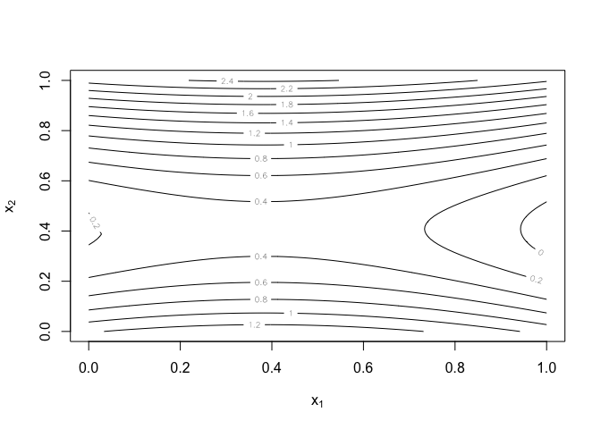
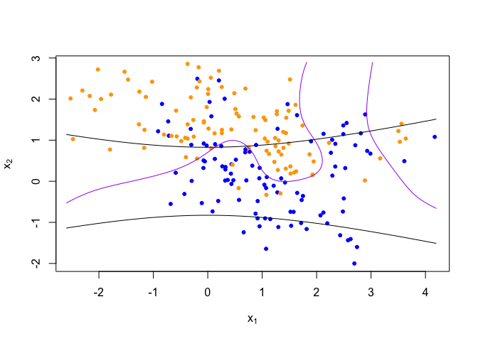

Homework 1
================
Dakota Wilson
1/25/2022

Required libraries:

``` r
library('class')
library('dplyr')
```

    ## 
    ## Attaching package: 'dplyr'

    ## The following objects are masked from 'package:stats':
    ## 
    ##     filter, lag

    ## The following objects are masked from 'package:base':
    ## 
    ##     intersect, setdiff, setequal, union

### Question 1

``` r
## load binary classification example data from author website 
## 'ElemStatLearn' package no longer available
load(url('https://web.stanford.edu/~hastie/ElemStatLearn/datasets/ESL.mixture.rda'))
dat <- ESL.mixture

plot_mix_data <- expression({
  plot(dat$x[,1], dat$x[,2],
       col=ifelse(dat$y==0, 'blue', 'orange'),
       pch=20,
       xlab=expression(x[1]),
       ylab=expression(x[2]))
  ## draw Bayes (True) classification boundary
  prob <- matrix(dat$prob, length(dat$px1), length(dat$px2))
  cont <- contourLines(dat$px1, dat$px2, prob, levels=0.5)
  rslt <- sapply(cont, lines, col='purple')
})

eval(plot_mix_data)
```

<!-- -->

``` r
## fit linear classifier
#fit_lc <- function(y, x) {
#  x <- cbind(1, x)
#  beta <- drop(solve(t(x)%*%x)%*%t(x)%*%y)
#}
fit_lc = function(y ,x)
{
  beta = coef(lm(y~x))
}
## make predictions from linear classifier
predict_lc <- function(x, beta) {
  cbind(1, x) %*% beta
}
lc_beta <- fit_lc(dat$y, dat$x)
lc_pred <- predict_lc(dat$xnew, lc_beta)
## reshape predictions as a matrix
lc_pred <- matrix(lc_pred, length(dat$px1), length(dat$px2))
contour(lc_pred,
      xlab=expression(x[1]),
      ylab=expression(x[2]))
```

<!-- -->

``` r
## find the contours in 2D space such that lc_pred == 0.5
lc_cont <- contourLines(dat$px1, dat$px2, lc_pred, levels=0.5)

## plot data and decision surface
eval(plot_mix_data)
sapply(lc_cont, lines)
```

<!-- -->

    ## [[1]]
    ## NULL

### Question 2

``` r
## load binary classification example data from author website 
## 'ElemStatLearn' package no longer available
load(url('https://web.stanford.edu/~hastie/ElemStatLearn/datasets/ESL.mixture.rda'))
dat <- ESL.mixture

plot_mix_data <- expression({
  plot(dat$x[,1], dat$x[,2],
       col=ifelse(dat$y==0, 'blue', 'orange'),
       pch=20,
       xlab=expression(x[1]),
       ylab=expression(x[2]))
  ## draw Bayes (True) classification boundary
  prob <- matrix(dat$prob, length(dat$px1), length(dat$px2))
  cont <- contourLines(dat$px1, dat$px2, prob, levels=0.5)
  rslt <- sapply(cont, lines, col='purple')
})

eval(plot_mix_data)
```

<!-- -->

``` r
## fit linear classifier
#fit_lc <- function(y, x) {
#  x <- cbind(1, x)
#  beta <- drop(solve(t(x)%*%x)%*%t(x)%*%y)
#}
fit_lc = function(y ,x)
{
  beta = coef(lm(y~x))
}
## make predictions from linear classifier
predict_lc <- function(x, beta) {
  cbind(1, x^2) %*% beta
}
lc_beta <- fit_lc(dat$y, dat$x)
lc_pred <- predict_lc(dat$xnew, lc_beta)
## reshape predictions as a matrix
lc_pred <- matrix(lc_pred, length(dat$px1), length(dat$px2))
contour(lc_pred,
      xlab=expression(x[1]),
      ylab=expression(x[2]))
```

<!-- -->

``` r
## find the contours in 2D space such that lc_pred == 0.5
lc_cont <- contourLines(dat$px1, dat$px2, lc_pred, levels=0.5)

## plot data and decision surface
eval(plot_mix_data)
sapply(lc_cont, lines)
```

<!-- -->

    ## [[1]]
    ## NULL
    ## 
    ## [[2]]
    ## NULL

### Question 3

When squaring our terms, the bias is low but there is a tradeoff in
variance.
