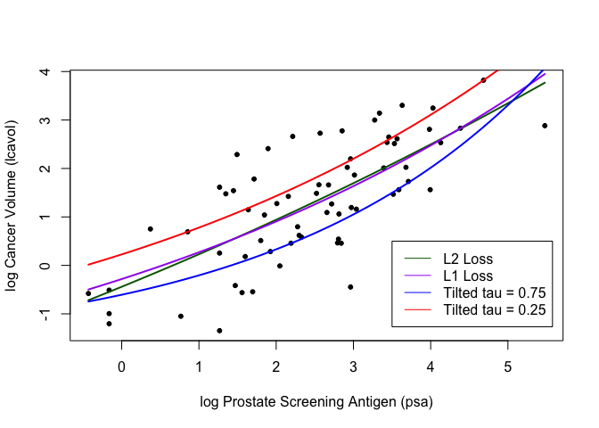

Homework 2
================
Dakota Wilson
2/3/2022

# Setup

``` r
library(qrnn)
## load prostate data
prostate <- 
  read.table(url(
    'https://web.stanford.edu/~hastie/ElemStatLearn/datasets/prostate.data'))

## subset to training examples
prostate_train <- subset(prostate, train==TRUE)

## plot lcavol vs lpsa
plot_psa_data <- function(dat=prostate_train) {
  plot(dat$lpsa, dat$lcavol,
       xlab="log Prostate Screening Antigen (psa)",
       ylab="log Cancer Volume (lcavol)",
       pch = 20)
}
plot_psa_data()

############################
## regular linear regression
############################

## L2 loss function
L2_loss <- function(y, yhat)
  (y-yhat)^2

## fit simple linear model using numerical optimization
fit_lin <- function(y, x, loss=L2_loss, beta_init = c(-0.51, 0.75)) {
  err <- function(beta)
    mean(loss(y,  beta[1] + beta[2]*x))
  beta <- optim(par = beta_init, fn = err)
  return(beta)
}

## make predictions from linear model
predict_lin <- function(x, beta)
  beta[1] + beta[2]*x

## fit linear model
lin_beta <- fit_lin(y=prostate_train$lcavol,
                    x=prostate_train$lpsa,
                    loss=L2_loss)

## compute predictions for a grid of inputs
x_grid <- seq(min(prostate_train$lpsa),
              max(prostate_train$lpsa),
              length.out=100)
lin_pred <- predict_lin(x=x_grid, beta=lin_beta$par)

## plot data
plot_psa_data()

## plot predictions
lines(x=x_grid, y=lin_pred, col='darkgreen', lwd=2)

## do the same thing with 'lm'
lin_fit_lm <- lm(lcavol ~ lpsa, data=prostate_train)

## make predictins using 'lm' object
lin_pred_lm <- predict(lin_fit_lm, data.frame(lpsa=x_grid))

## plot predictions from 'lm'
lines(x=x_grid, y=lin_pred_lm, col='pink', lty=2, lwd=2)
```

<!-- -->

``` r
##################################
## try modifying the loss function
##################################
## custom loss function
custom_loss <- function(y, yhat)
  abs(y-yhat)

## plot custom loss function
err_grd <- seq(-1,1,length.out=200)
plot(err_grd, custom_loss(err_grd,0), type='l',
     xlab='y-yhat', ylab='custom loss')
```

<!-- -->

``` r
## fit linear model with custom loss
lin_beta_custom <- fit_lin(y=prostate_train$lcavol,
                    x=prostate_train$lpsa,
                    loss=custom_loss)

lin_pred_custom <- predict_lin(x=x_grid, beta=lin_beta_custom$par)

## plot data
plot_psa_data()

## plot predictions from L2 loss
lines(x=x_grid, y=lin_pred, col='darkgreen', lwd=2)

## plot predictions from custom loss
lines(x=x_grid, y=lin_pred_custom, col='pink', lwd=2, lty=2)
```

<!-- -->

\#Question 1

``` r
## custom loss function
custom_loss <- function(y, yhat)
  abs(y-yhat)
#tilted loss function
tilted_loss = function(y, yhat)
  tilted.abs(y - yhat, tau = 0.5)

## plot custom loss function
err_grd <- seq(-1,1,length.out=200)
plot(err_grd, custom_loss(err_grd,0), type='l',
     xlab='y-yhat', ylab='custom loss')
```

<!-- -->

``` r
## fit linear model with custom loss
lin_beta_custom <- fit_lin(y=prostate_train$lcavol,
                    x=prostate_train$lpsa,
                    loss=custom_loss)

lin_pred_custom <- predict_lin(x=x_grid, beta=lin_beta_custom$par)

## plot data
plot_psa_data()

## plot predictions from L2 loss
lines(x=x_grid, y=lin_pred, col='darkgreen', lwd=2)

## plot predictions from custom loss
lines(x=x_grid, y=lin_pred_custom, col='pink', lwd=2, lty=2)
```

<!-- --> \#
Question 2

``` r
## L2 loss function
L2_loss <- function(y, yhat)
  (y-yhat)^2

## fit simple linear model using numerical optimization
fit_lin <- function(y, x, loss=L2_loss, beta_init = c(-0.51, 0.75)) {
  err <- function(beta)
    mean(loss(y,  beta[1] + beta[2]*x))
  beta <- optim(par = beta_init, fn = err)
  return(beta)
}

## make predictions from linear model
predict_lin <- function(x, beta)
  beta[1] + beta[2]*x

## fit linear model
lin_beta <- fit_lin(y=prostate_train$lcavol,
                    x=prostate_train$lpsa,
                    loss=L2_loss)

## compute predictions for a grid of inputs
x_grid <- seq(min(prostate_train$lpsa),
              max(prostate_train$lpsa),
              length.out=100)
lin_pred <- predict_lin(x=x_grid, beta=lin_beta$par)

## plot data
plot_psa_data()

## plot predictions
lines(x=x_grid, y=lin_pred, col='darkgreen', lwd=2)

## L1 loss function
L1_loss <- function(y, yhat)
  abs(y-yhat)

## fit simple linear model using numerical optimization
fit_lin <- function(y, x, loss=L1_loss, beta_init = c(-0.51, 0.75)) {
  err <- function(beta)
    mean(loss(y,  beta[1] + beta[2]*x))
  beta <- optim(par = beta_init, fn = err)
  return(beta)
}

## make predictions from linear model
predict_lin <- function(x, beta)
  beta[1] + beta[2]*x

## fit linear model
lin_beta <- fit_lin(y=prostate_train$lcavol,
                    x=prostate_train$lpsa,
                    loss=L1_loss)

## compute predictions for a grid of inputs
x_grid <- seq(min(prostate_train$lpsa),
              max(prostate_train$lpsa),
              length.out=100)
lin_pred <- predict_lin(x=x_grid, beta=lin_beta$par)

## plot predictions
lines(x=x_grid, y=lin_pred, col='pink', lwd=2)

## tilted tau = 0.75
tilted_loss_75 = function(y, yhat)
  tilted.abs(y - yhat, tau = 0.75)

## fit simple linear model using numerical optimization
fit_lin <- function(y, x, loss=tilted_loss_75, beta_init = c(-0.51, 0.75)) {
  err <- function(beta)
    mean(loss(y,  beta[1] + beta[2]*x))
  beta <- optim(par = beta_init, fn = err)
  return(beta)
}

## make predictions from linear model
predict_lin <- function(x, beta)
  beta[1] + beta[2]*x

## fit linear model
lin_beta <- fit_lin(y=prostate_train$lcavol,
                    x=prostate_train$lpsa,
                    loss=tilted_loss_75)

## compute predictions for a grid of inputs
x_grid <- seq(min(prostate_train$lpsa),
              max(prostate_train$lpsa),
              length.out=100)
lin_pred <- predict_lin(x=x_grid, beta=lin_beta$par)

## plot predictions
lines(x=x_grid, y=lin_pred, col='blue', lwd=2)

## tilted tau = 0.25
tilted_loss_25 = function(y, yhat)
  tilted.abs(y - yhat, tau = 0.25)

## fit simple linear model using numerical optimization
fit_lin <- function(y, x, loss=tilted_loss_25, beta_init = c(-0.51, 0.75)) {
  err <- function(beta)
    mean(loss(y,  beta[1] + beta[2]*x))
  beta <- optim(par = beta_init, fn = err)
  return(beta)
}

## make predictions from linear model
predict_lin <- function(x, beta)
  beta[1] + beta[2]*x

## fit linear model
lin_beta <- fit_lin(y=prostate_train$lcavol,
                    x=prostate_train$lpsa,
                    loss=tilted_loss_25)

## compute predictions for a grid of inputs
x_grid <- seq(min(prostate_train$lpsa),
              max(prostate_train$lpsa),
              length.out=100)
lin_pred <- predict_lin(x=x_grid, beta=lin_beta$par)

## plot predictions
lines(x=x_grid, y=lin_pred, col='red', lwd=2)

# Legend

legend(x =  3.5, y = .5,legend = c('L2 Loss','L1 Loss','Tilted tau = 0.75','Tilted tau = 0.25'),
       col = c('darkgreen','pink','blue','red'),
       lty = 1)
```

<!-- -->

# Question 3

``` r
## fit simple non-linear model using numerical optimization
fit_non_lin <- function(y, x, loss, beta_init = c(-1.0, 0.0, 0.3)) {
  err <- function(beta)
    mean(loss(y,  beta[1] + beta[2]*exp(-beta[3]*x)))
  beta <- optim(par = beta_init, fn = err)
  return(beta)
}

## make predictions from non-linear model
predict_non_lin <- function(x, beta)
  beta[1] + beta[2]*exp(-beta[3]*x)
```

# Question 4

``` r
#PLOTS 
plot_psa_data()
## fit nonlinear model
lin_beta <- fit_non_lin(y=prostate_train$lcavol,
                    x=prostate_train$lpsa,
                    loss=L2_loss)

## compute predictions for a grid of inputs
x_grid <- seq(min(prostate_train$lpsa),
              max(prostate_train$lpsa),
              length.out=100)
lin_pred <- predict_non_lin(x=x_grid, beta=lin_beta$par)

## plot data

## plot predictions
lines(x=x_grid, y=lin_pred, col='darkgreen', lwd=2)


## fit linear model
lin_beta <- fit_non_lin(y=prostate_train$lcavol,
                    x=prostate_train$lpsa,
                    loss=L1_loss)

## compute predictions for a grid of inputs
x_grid <- seq(min(prostate_train$lpsa),
              max(prostate_train$lpsa),
              length.out=100)
lin_pred <- predict_non_lin(x=x_grid, beta=lin_beta$par)
print(lin_pred)
```

    ##   [1] 0.07045229 0.08588032 0.10158615 0.11757476 0.13385125 0.15042080
    ##   [7] 0.16728869 0.18446030 0.20194108 0.21973661 0.23785256 0.25629469
    ##  [13] 0.27506887 0.29418109 0.31363743 0.33344408 0.35360736 0.37413369
    ##  [19] 0.39502960 0.41630174 0.43795690 0.46000196 0.48244395 0.50529002
    ##  [25] 0.52854744 0.55222361 0.57632608 0.60086252 0.62584074 0.65126871
    ##  [31] 0.67715452 0.70350640 0.73033276 0.75764214 0.78544323 0.81374488
    ##  [37] 0.84255612 0.87188611 0.90174419 0.93213988 0.96308285 0.99458296
    ##  [43] 1.02665024 1.05929489 1.09252733 1.12635812 1.16079805 1.19585807
    ##  [49] 1.23154937 1.26788329 1.30487142 1.34252553 1.38085762 1.41987988
    ##  [55] 1.45960475 1.50004488 1.54121314 1.58312266 1.62578676 1.66921904
    ##  [61] 1.71343334 1.75844372 1.80426453 1.85091036 1.89839606 1.94673675
    ##  [67] 1.99594783 2.04604498 2.09704413 2.14896154 2.20181374 2.25561755
    ##  [73] 2.31039012 2.36614889 2.42291160 2.48069635 2.53952153 2.59940587
    ##  [79] 2.66036845 2.72242867 2.78560631 2.84992148 2.91539467 2.98204671
    ##  [85] 3.04989885 3.11897268 3.18929021 3.26087382 3.33374632 3.40793091
    ##  [91] 3.48345122 3.56033129 3.63859560 3.71826909 3.79937712 3.88194553
    ##  [97] 3.96600060 4.05156911 4.13867831 4.22735593

``` r
lines(x=x_grid, y=lin_pred, col='purple', lwd=2)

## fit linear model
lin_beta <- fit_non_lin(y=prostate_train$lcavol,
                    x=prostate_train$lpsa,
                    loss=tilted_loss_25)

## compute predictions for a grid of inputs
x_grid <- seq(min(prostate_train$lpsa),
              max(prostate_train$lpsa),
              length.out=100)
lin_pred <- predict_non_lin(x=x_grid, beta=lin_beta$par)

lines(x=x_grid, y=lin_pred, col='blue', lwd=2)

## fit linear model
lin_beta <- fit_non_lin(y=prostate_train$lcavol,
                    x=prostate_train$lpsa,
                    loss=tilted_loss_75)

## compute predictions for a grid of inputs
x_grid <- seq(min(prostate_train$lpsa),
              max(prostate_train$lpsa),
              length.out=100)
lin_pred <- predict_non_lin(x=x_grid, beta=lin_beta$par)

lines(x=x_grid, y=lin_pred, col='red', lwd=2)

legend(x =  3.5, y = .5,legend = c('L2 Loss','L1 Loss','Tilted tau = 0.75','Tilted tau = 0.25'),
       col = c('darkgreen','purple','blue','red'),
       lty = 1)
```

<!-- -->
