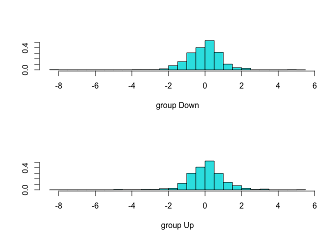
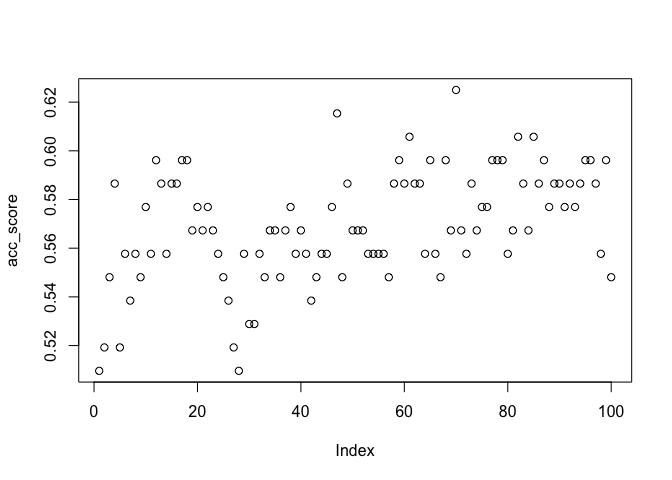

Homework 4
================
Dakota Wilson
2/20/2022

### Question 4

**a) Suppose that we have a set of observations, each with measurements
on p = 1 feature, X. We assume that X is uniformly (evenly) distributed
on \[0, 1\]. Associated with each observation is a response value.
Suppose that we wish to predict a test observation’s response using only
observations that are within 10 % of the range of X closest to that test
observation. For instance, in order to predict the response for a test
observation with X = 0.6, we will use observations in the range
\[0.55,0.65\]. On average, what fraction of the available observations
will we use to make the prediction?**

We would expect slightly less than 10% of the avaliable observations
used in each prediciton. This would be exactly 10%, except for on the
edges (&lt;.05 and &gt;.95), where there would not be enough room one
one side to collect all of the needed 5%. This comes out to exactly:

``` r
(.90*.1)+(.02*.09)+(.02*.08)+(.02*.07)+(.02*.06)+(.02*.05)
```

    ## [1] 0.097

9.7% of the time

**b) Now suppose that we have a set of observations, each with
measurements on p = 2 features, X1 and X2. We assume that (X1, X2) are
uniformly distributed on \[0, 1\] × \[0, 1\]. We wish to predict a test
observation’s response using only observations that are within 10 % of
the range of X1 and within 10 % of the range of X2 closest to that test
observation. For instance, in order to predict the response for a test
observation with X1 = 0.6 and X2 = 0.35, we will use observations in the
range \[0.55, 0.65\] for X1 and in the range \[0.3,0.4\] for X2. On
average, what fraction of the available observations will we use to make
the prediction?**

If there are now two directions, we can multiply the result of the first
portion by itself. This would simply be .097\*.097 = .009409 which is
rougly equal to 1%.

**c) Now suppose that we have a set of observations on p = 100 features.
Again the observations are uniformly distributed on each feature, and
again each feature ranges in value from 0 to 1. We wish to predict a
test observation’s response using observations within the 10 % of each
feature’s range that is closest to that test observation. What fraction
of the available observations will we use to make the prediction?**

This is the same principal as before, except now it is to the power of
100. This comes out to 4.755251e-102, which is so small it can be
assumed the percentage is zero. This means no observations will be
available for prediction.

**d) Using your answers to parts (a)–(c), argue that a drawback of KNN
when p is large is that there are very few training observations “near”
any given test observation.**

When p is large, there is a low amount of available observations for
prediction, and the availability continues to decrease the larger that p
is.

**e) Now suppose that we wish to make a prediction for a test
observation by creating a p-dimensional hypercube centered around the
test observation that contains, on average, 10 % of the training
observations. For p = 1,2, and 100, what is the length of each side of
the hypercube? Comment on your answer.**

This would be set up similarly to the last four parts, except instead of
using 9.7%, we would just use 10%. This gives us 10% for p = 1, 1% for p
= 2 and 1e-98% for p = 100.

### Question 13

**This question should be answered using the Weekly data set, which is
part of the ISLR2 package. This data is similar in nature to the Smarket
data from this chapter’s lab, except that it contains 1, 089 weekly
returns for 21 years, from the beginning of 1990 to the end of 2010.**

**(a) Produce some numerical and graphical summaries of the Weekly data.
Do there appear to be any patterns?**

``` r
summary(weekly)
```

    ##       Year           Lag1               Lag2               Lag3         
    ##  Min.   :1990   Min.   :-18.1950   Min.   :-18.1950   Min.   :-18.1950  
    ##  1st Qu.:1995   1st Qu.: -1.1540   1st Qu.: -1.1540   1st Qu.: -1.1580  
    ##  Median :2000   Median :  0.2410   Median :  0.2410   Median :  0.2410  
    ##  Mean   :2000   Mean   :  0.1506   Mean   :  0.1511   Mean   :  0.1472  
    ##  3rd Qu.:2005   3rd Qu.:  1.4050   3rd Qu.:  1.4090   3rd Qu.:  1.4090  
    ##  Max.   :2010   Max.   : 12.0260   Max.   : 12.0260   Max.   : 12.0260  
    ##       Lag4               Lag5              Volume            Today         
    ##  Min.   :-18.1950   Min.   :-18.1950   Min.   :0.08747   Min.   :-18.1950  
    ##  1st Qu.: -1.1580   1st Qu.: -1.1660   1st Qu.:0.33202   1st Qu.: -1.1540  
    ##  Median :  0.2380   Median :  0.2340   Median :1.00268   Median :  0.2410  
    ##  Mean   :  0.1458   Mean   :  0.1399   Mean   :1.57462   Mean   :  0.1499  
    ##  3rd Qu.:  1.4090   3rd Qu.:  1.4050   3rd Qu.:2.05373   3rd Qu.:  1.4050  
    ##  Max.   : 12.0260   Max.   : 12.0260   Max.   :9.32821   Max.   : 12.0260  
    ##  Direction 
    ##  Down:484  
    ##  Up  :605  
    ##            
    ##            
    ##            
    ## 

**(b) Use the full data set to perform a logistic regression with
Direction as the response and the five lag variables plus Volume as
predictors. Use the summary function to print the results. Do any of the
predictors appear to be statistically significant? If so, which ones?**

``` r
glm.fit = glm(Direction ~ Lag1 + Lag2 + Lag3 + Lag4 + Lag5 + Volume, data = weekly, family = binomial)
summary(glm.fit)
```

    ## 
    ## Call:
    ## glm(formula = Direction ~ Lag1 + Lag2 + Lag3 + Lag4 + Lag5 + 
    ##     Volume, family = binomial, data = weekly)
    ## 
    ## Deviance Residuals: 
    ##     Min       1Q   Median       3Q      Max  
    ## -1.6949  -1.2565   0.9913   1.0849   1.4579  
    ## 
    ## Coefficients:
    ##             Estimate Std. Error z value Pr(>|z|)   
    ## (Intercept)  0.26686    0.08593   3.106   0.0019 **
    ## Lag1        -0.04127    0.02641  -1.563   0.1181   
    ## Lag2         0.05844    0.02686   2.175   0.0296 * 
    ## Lag3        -0.01606    0.02666  -0.602   0.5469   
    ## Lag4        -0.02779    0.02646  -1.050   0.2937   
    ## Lag5        -0.01447    0.02638  -0.549   0.5833   
    ## Volume      -0.02274    0.03690  -0.616   0.5377   
    ## ---
    ## Signif. codes:  0 '***' 0.001 '**' 0.01 '*' 0.05 '.' 0.1 ' ' 1
    ## 
    ## (Dispersion parameter for binomial family taken to be 1)
    ## 
    ##     Null deviance: 1496.2  on 1088  degrees of freedom
    ## Residual deviance: 1486.4  on 1082  degrees of freedom
    ## AIC: 1500.4
    ## 
    ## Number of Fisher Scoring iterations: 4

Lag2 appears to be statistically significant at the .01 level.

**(c) Compute the confusion matrix and overall fraction of correct
predictions. Explain what the confusion matrix is telling you about the
types of mistakes made by logistic regression.**

``` r
glm.probs <- predict(glm.fit, type = "response")
contrasts(weekly$Direction)
```

    ##      Up
    ## Down  0
    ## Up    1

``` r
glm.pred <- rep("Down", length(weekly$Direction))
glm.pred[glm.probs > .5] = "Up"
table(glm.pred, weekly$Direction)
```

    ##         
    ## glm.pred Down  Up
    ##     Down   54  48
    ##     Up    430 557

``` r
(557+54)/1089
```

    ## [1] 0.5610652

``` r
mean(glm.pred ==  weekly$Direction)
```

    ## [1] 0.5610652

This means that only 56.1% of my predictions are considered accurate.

**(d) Now fit the logistic regression model using a training data period
from 1990 to 2008, with Lag2 as the only predictor. Compute the
confusion matrix and the overall fraction of correct predictions for the
held out data (that is, the data from 2009 and 2010).**

``` r
train = weekly %>% filter(Year <= 2008)
test = weekly %>% filter(Year >= 2009)
glm.fit = glm(Direction ~ Lag2, data = train, family = binomial)
summary(glm.fit)
```

    ## 
    ## Call:
    ## glm(formula = Direction ~ Lag2, family = binomial, data = train)
    ## 
    ## Deviance Residuals: 
    ##    Min      1Q  Median      3Q     Max  
    ## -1.536  -1.264   1.021   1.091   1.368  
    ## 
    ## Coefficients:
    ##             Estimate Std. Error z value Pr(>|z|)   
    ## (Intercept)  0.20326    0.06428   3.162  0.00157 **
    ## Lag2         0.05810    0.02870   2.024  0.04298 * 
    ## ---
    ## Signif. codes:  0 '***' 0.001 '**' 0.01 '*' 0.05 '.' 0.1 ' ' 1
    ## 
    ## (Dispersion parameter for binomial family taken to be 1)
    ## 
    ##     Null deviance: 1354.7  on 984  degrees of freedom
    ## Residual deviance: 1350.5  on 983  degrees of freedom
    ## AIC: 1354.5
    ## 
    ## Number of Fisher Scoring iterations: 4

``` r
glm.probs <- predict(glm.fit,test, type = "response")
contrasts(test$Direction)
```

    ##      Up
    ## Down  0
    ## Up    1

``` r
glm.pred <- rep("Down", length(test$Direction))
glm.pred[glm.probs > .5] = "Up"
table(glm.pred, test$Direction)
```

    ##         
    ## glm.pred Down Up
    ##     Down    9  5
    ##     Up     34 56

``` r
mean(glm.pred ==  test$Direction)
```

    ## [1] 0.625

This means that only 62.5% of my predictions are considered accurate.

**Repeat (d) using LDA**

``` r
lda.fit <- lda(Direction~ Lag2,data = train)
summary(lda.fit)
```

    ##         Length Class  Mode     
    ## prior   2      -none- numeric  
    ## counts  2      -none- numeric  
    ## means   2      -none- numeric  
    ## scaling 1      -none- numeric  
    ## lev     2      -none- character
    ## svd     1      -none- numeric  
    ## N       1      -none- numeric  
    ## call    3      -none- call     
    ## terms   3      terms  call     
    ## xlevels 0      -none- list

``` r
lda.probs <- predict(lda.fit,test, type = "response")
contrasts(test$Direction)
```

    ##      Up
    ## Down  0
    ## Up    1

``` r
lda.pred <- rep("Down", length(test$Direction))
lda.pred[lda.probs$class == 'Up'] = "Up"
table(lda.pred, test$Direction)
```

    ##         
    ## lda.pred Down Up
    ##     Down    9  5
    ##     Up     34 56

``` r
mean(lda.pred ==  test$Direction)
```

    ## [1] 0.625

``` r
plot(lda.fit)
```

<!-- -->

Once agaibn, 62.5%

**(f) Repeat (d) using QDA.**

``` r
qda.fit <- qda(Direction~ Lag2,data = train)
qda.probs <- predict(qda.fit,test, type = "response")
contrasts(test$Direction)
```

    ##      Up
    ## Down  0
    ## Up    1

``` r
qda.pred <- rep("Down", length(test$Direction))
qda.pred[qda.probs$class == 'Up'] = "Up"
table(qda.pred, test$Direction)
```

    ##         
    ## qda.pred Down Up
    ##       Up   43 61

``` r
mean(qda.pred == test$Direction)
```

    ## [1] 0.5865385

58.6%. Using QDA, my model predicted every one to be Up.

**(g) Repeat (d) using KNN with K = 1.**

``` r
train.X = cbind(train$Lag2)
test.X = cbind(test$Lag2)
train.Direction = train$Direction
knn.pred  = knn(train.X, test.X, train.Direction,  k =1)
table(knn.pred, test$Direction)
```

    ##         
    ## knn.pred Down Up
    ##     Down   21 29
    ##     Up     22 32

``` r
mean(knn.pred == test$Direction)
```

    ## [1] 0.5096154

50.9%

**(h) Repeat (d) using naive Bayes.**

``` r
nb.fit <- naiveBayes(Direction ~ Lag2, data = train)
nb.fit
```

    ## 
    ## Naive Bayes Classifier for Discrete Predictors
    ## 
    ## Call:
    ## naiveBayes.default(x = X, y = Y, laplace = laplace)
    ## 
    ## A-priori probabilities:
    ## Y
    ##      Down        Up 
    ## 0.4477157 0.5522843 
    ## 
    ## Conditional probabilities:
    ##       Lag2
    ## Y             [,1]     [,2]
    ##   Down -0.03568254 2.199504
    ##   Up    0.26036581 2.317485

``` r
nb.class <- predict(nb.fit, test)
table(nb.class, test$Direction)
```

    ##         
    ## nb.class Down Up
    ##     Down    0  0
    ##     Up     43 61

``` r
mean(nb.class == test$Direction)
```

    ## [1] 0.5865385

58.6% once again

**(i) Which of these methods appears to provide the best results on this
data?**

Logistic regression and linear discriminant analysis had the best
predictors for this particular dataset.

**(j) Experiment with different combinations of predictors, including
possible transformations and interactions, for each of the methods.
Report the variables, method, and associated confusion matrix that
appears to provide the best results on the held out data. Note that you
should also experiment with values for K in the KNN classifier.**

LM:

``` r
glm.fit = glm(Direction ~ Lag2+Lag5, data = train, family = quasibinomial)
summary(glm.fit)
```

    ## 
    ## Call:
    ## glm(formula = Direction ~ Lag2 + Lag5, family = quasibinomial, 
    ##     data = train)
    ## 
    ## Deviance Residuals: 
    ##    Min      1Q  Median      3Q     Max  
    ## -1.774  -1.257   1.013   1.091   1.403  
    ## 
    ## Coefficients:
    ##             Estimate Std. Error t value Pr(>|t|)   
    ## (Intercept)  0.20741    0.06456   3.213  0.00136 **
    ## Lag2         0.05652    0.02890   1.956  0.05078 . 
    ## Lag5        -0.02973    0.02877  -1.033  0.30172   
    ## ---
    ## Signif. codes:  0 '***' 0.001 '**' 0.01 '*' 0.05 '.' 0.1 ' ' 1
    ## 
    ## (Dispersion parameter for quasibinomial family taken to be 1.0033)
    ## 
    ##     Null deviance: 1354.7  on 984  degrees of freedom
    ## Residual deviance: 1349.5  on 982  degrees of freedom
    ## AIC: NA
    ## 
    ## Number of Fisher Scoring iterations: 4

``` r
glm.probs <- predict(glm.fit,test, type = "response")
contrasts(test$Direction)
```

    ##      Up
    ## Down  0
    ## Up    1

``` r
glm.pred <- rep("Down", length(test$Direction))
glm.pred[glm.probs > .5] = "Up"
table(glm.pred, test$Direction)
```

    ##         
    ## glm.pred Down Up
    ##     Down    7  5
    ##     Up     36 56

``` r
mean(glm.pred ==  test$Direction)
```

    ## [1] 0.6057692

For linear regression, I was not able to get a higher result than the
original .625 given the train and test sets outlined. The best I got was
.6057 with Lag2 and Lag5.

LDA:

``` r
lda.fit <- lda(Direction~ Lag2+Year,data = train)
lda.probs <- predict(lda.fit,test, type = "response")
contrasts(test$Direction)
```

    ##      Up
    ## Down  0
    ## Up    1

``` r
lda.pred <- rep("Down", length(test$Direction))
lda.pred[lda.probs$class == 'Up'] = "Up"
table(lda.pred, test$Direction)
```

    ##         
    ## lda.pred Down Up
    ##     Down   13 13
    ##     Up     30 48

``` r
mean(lda.pred ==  test$Direction)
```

    ## [1] 0.5865385

Once again, with LDA, I was not able to get a higher score however I did
get a score of .5865 using Year and Lag2.

QDA:

``` r
qda.fit <- qda(Direction~ Lag2+Lag3,data = train)
qda.probs <- predict(qda.fit,test, type = "response")
contrasts(test$Direction)
```

    ##      Up
    ## Down  0
    ## Up    1

``` r
qda.pred <- rep("Down", length(test$Direction))
qda.pred[qda.probs$class == 'Up'] = "Up"
table(qda.pred, test$Direction)
```

    ##         
    ## qda.pred Down Up
    ##     Down    4  2
    ##     Up     39 59

``` r
mean(qda.pred == test$Direction)
```

    ## [1] 0.6057692

With QDA, I was able to improve the model and got a score of .605 by
using Lag2 and Lag3.

Naive-Bayes:

``` r
nb.fit <- naiveBayes(Direction ~ Lag4, data = train)
nb.fit
```

    ## 
    ## Naive Bayes Classifier for Discrete Predictors
    ## 
    ## Call:
    ## naiveBayes.default(x = X, y = Y, laplace = laplace)
    ## 
    ## A-priori probabilities:
    ## Y
    ##      Down        Up 
    ## 0.4477157 0.5522843 
    ## 
    ## Conditional probabilities:
    ##       Lag4
    ## Y            [,1]     [,2]
    ##   Down 0.15925624 2.400042
    ##   Up   0.09220956 2.165612

``` r
nb.class <- predict(nb.fit, test)
table(nb.class, test$Direction)
```

    ##         
    ## nb.class Down Up
    ##     Down    7 12
    ##     Up     36 49

``` r
mean(nb.class == test$Direction)
```

    ## [1] 0.5384615

Once again, I was not able to improve the naive-bayes model. I did
however notice a decent difference in the confusion matrices depending
on variables chosen.

K - means:

``` r
train.X = cbind(train$Lag2)
test.X = cbind(test$Lag2)
train.Direction = train$Direction
acc_score = seq(0,0)
for (i in 1:100){
knn.pred  = knn(train.X, test.X, train.Direction,  k = i)
acc_score[i] = mean(knn.pred == test$Direction)
}
acc_score = cbind(acc_score)
plot(acc_score)
```

<!-- -->

k = 47 gives me the strongest predictor using only Lag2 and the
described train dataset. The final accuracy value comes out to .615.
