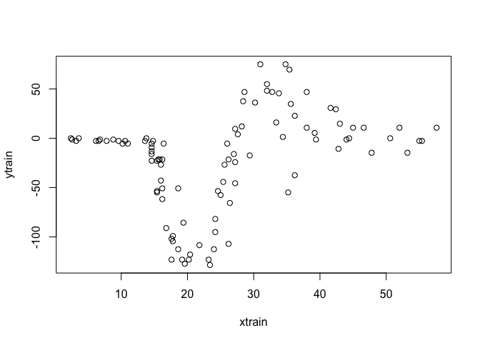
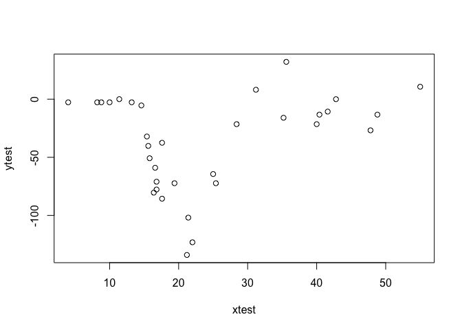
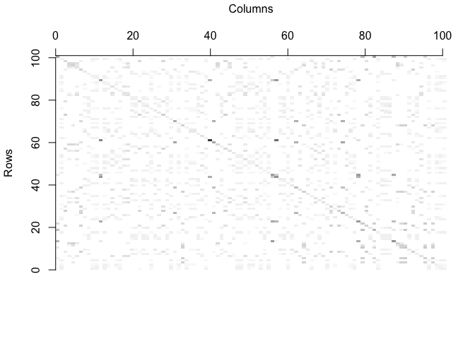
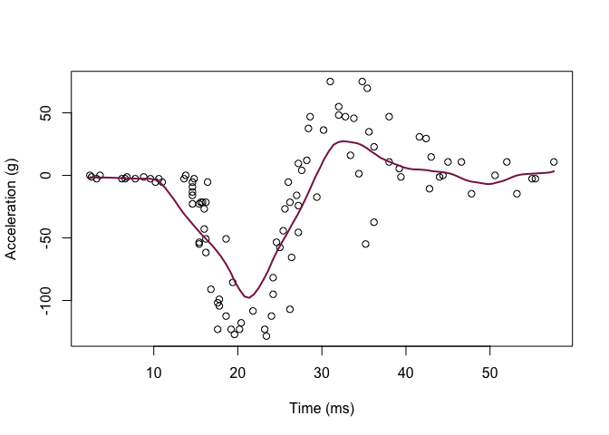
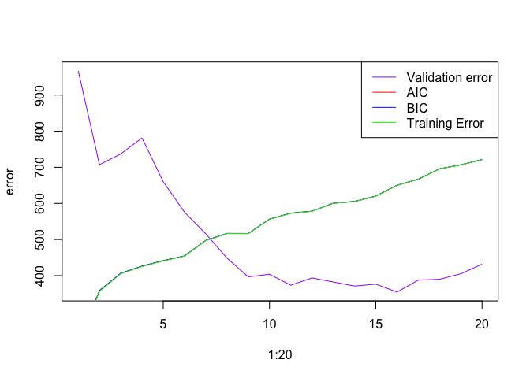
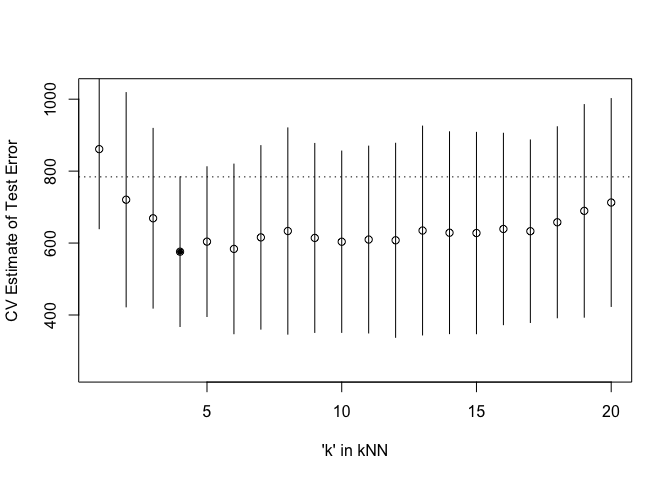

Homework 5
================
Dakota Wilson
3/2/2022

``` r
mcycle = mcycle

y <- mcycle$accel
x <- matrix(mcycle$times, length(mcycle$times), 1)

plot(x, y, xlab="Time (ms)", ylab="Acceleration (g)")
```

<!-- -->

First, I split the data into a training and validation set.

``` r
set.seed(23188)
#75% of dataset length is equal to 100
train_index = sample(1:nrow(mcycle), 100, replace = F) 
train = mcycle[train_index,]
validation = mcycle[-train_index,]
ytrain <- train$accel
xtrain <- matrix(train$times, length(train$times), 1)
ytest = validation$accel
xtest = matrix(validation$times, length(validation$times),1)

plot(xtrain,ytrain)
```

<!-- -->

``` r
plot(xtest,ytest)
```

<!-- -->

All of my given functions:

``` r
## Epanechnikov kernel function
## x  - n x p matrix of training inputs
## x0 - 1 x p input where to make prediction
## lambda - bandwidth (neighborhood size)
kernel_epanechnikov <- function(x, x0, lambda=1) {
  d <- function(t)
    ifelse(t <= 1, 3/4*(1-t^2), 0)
  z <- t(t(x) - x0)
  d(sqrt(rowSums(z*z))/lambda)
}

## k-NN kernel function
## x  - n x p matrix of training inputs
## x0 - 1 x p input where to make prediction
## k  - number of nearest neighbors
kernel_k_nearest_neighbors <- function(x, x0, k=1) {
  ## compute distance betwen each x and x0
  z <- t(t(x) - x0)
  d <- sqrt(rowSums(z*z))

  ## initialize kernel weights to zero
  w <- rep(0, length(d))
  
  ## set weight to 1 for k nearest neighbors
  w[order(d)[1:k]] <- 1
  
  return(w)
}

## Make predictions using the NW method
## y  - n x 1 vector of training outputs
## x  - n x p matrix of training inputs
## x0 - m x p matrix where to make predictions
## kern  - kernel function to use
## ... - arguments to pass to kernel function
nadaraya_watson <- function(y, x, x0, kern, ...) {
  k <- t(apply(x0, 1, function(x0_) {
    k_ <- kern(x, x0_, ...)
    k_/sum(k_)
  }))
  yhat <- drop(k %*% y)
  attr(yhat, 'k') <- k
  return(yhat)
}

## Helper function to view kernel (smoother) matrix
matrix_image <- function(x) {
  rot <- function(x) t(apply(x, 2, rev))
  cls <- rev(gray.colors(20, end=1))
  image(rot(x), col=cls, axes=FALSE)
  xlb <- pretty(1:ncol(x))
  xat <- (xlb-0.5)/ncol(x)
  ylb <- pretty(1:nrow(x))
  yat <- (ylb-0.5)/nrow(x)
  axis(3, at=xat, labels=xlb)
  axis(2, at=yat, labels=ylb)
  mtext('Rows', 2, 3)
  mtext('Columns', 3, 3)
}

## Compute effective df using NW method
## y  - n x 1 vector of training outputs
## x  - n x p matrix of training inputs
## kern  - kernel function to use
## ... - arguments to pass to kernel function
effective_df <- function(y, x, kern, ...) {
  y_hat <- nadaraya_watson(y, x, x,
    kern=kern, ...)
  sum(diag(attr(y_hat, 'k')))
}

## loss function
## y    - train/test y
## yhat - predictions at train/test x
loss_squared_error <- function(y, yhat)
  (y - yhat)^2

## test/train error
## y    - train/test y
## yhat - predictions at train/test x
## loss - loss function
error <- function(y, yhat, loss=loss_squared_error)
  mean(loss(y, yhat))

## AIC
## y    - training y
## yhat - predictions at training x
## d    - effective degrees of freedom
aic <- function(y, yhat, d)
  error(y, yhat) + 2/length(y)*d

## BIC
## y    - training y
## yhat - predictions at training x
## d    - effective degrees of freedom
bic <- function(y, yhat, d)
  error(y, yhat) + log(length(y))/length(y)*d


## make predictions using NW method at training inputs
y_hat <- nadaraya_watson(ytrain, xtrain, xtrain,
  kernel_epanechnikov, lambda=5)

## view kernel (smoother) matrix
matrix_image(attr(y_hat, 'k'))
```

<!-- -->

``` r
## compute effective degrees of freedom
edf <- effective_df(ytrain, xtrain, kernel_epanechnikov, lambda=5)
aic(ytrain, y_hat, edf)
```

    ## [1] 766.5437

``` r
bic(ytrain, y_hat, edf)
```

    ## [1] 766.7692

``` r
## create a grid of inputs 
x_plot <- matrix(seq(min(xtrain),max(xtrain),length.out=100),100,1)

## make predictions using NW method at each of grid points
y_hat_plot <- nadaraya_watson(y, x, x_plot,
  kernel_epanechnikov, lambda=5)

## plot predictions
plot(xtrain, ytrain, xlab="Time (ms)", ylab="Acceleration (g)")
lines(x_plot, y_hat_plot, col="#882255", lwd=2) 
```

<!-- -->

Running Nadaraya-Watson method with the k-NN kernel function

With the squared-error loss function, compute and plot the training
error, AIC, BIC, and validation error (using the validation data) as
functions of the tuning parameter.

``` r
aic_results = rep(NA, 20)
bic_results = rep(NA, 20)
train_error = rep(NA, 20)
validation_error = rep(NA,20)
for (i in 1:20){
   ## make predictions using NW method at training inputs
   y_hat <- nadaraya_watson(ytrain, xtrain, xtrain,
     kern=kernel_k_nearest_neighbors, k=i)
   y_hat_validation = nadaraya_watson(ytrain, xtrain, xtest,
     kern=kernel_k_nearest_neighbors, k=i)
   edf <- effective_df(ytrain, xtrain, 
     kern=kernel_k_nearest_neighbors, k=i)
   
   aic_results[i] <- aic(ytrain, y_hat, edf)
   bic_results[i] <- bic(ytrain, y_hat, edf)
   train_error[i] = error(ytrain, y_hat)
   validation_error[i] = error(ytest, y_hat_validation)
   
}
plot(1:20, validation_error, type = 'l', col = 'purple', ylab = 'error')
lines(1:20, aic_results, type = 'l', col = 'red')
lines(1:20, bic_results,type = 'l', col = 'blue')
lines(1:20, train_error, type = 'l', col = 'green')
legend("topright", legend=c("Validation error", "AIC", "BIC", "Training Error"),
       col=c("purple", "red", "blue", "green"), lty=1)
```

<!-- -->

For each value of the tuning parameter, Perform 5-fold cross-validation
using the combined training and validation data. This results in 5
estimates of test error per tuning parameter value.

``` r
inc_flds  <- createFolds(y, k=5)

sapply(inc_flds, length)  ## not all the same length
```

    ## Fold1 Fold2 Fold3 Fold4 Fold5 
    ##    28    26    26    26    27

``` r
cv <- function(kNN = 10, flds=inc_flds) {
  cverr <- rep(NA, length(flds))
  for(tst_idx in 1:length(flds)) { ## for each fold
    
    ## get training and testing data
    inc_trn <- mcycle[-flds[[tst_idx]],]
    inc_tst <- mcycle[ flds[[tst_idx]],]
    ## fit kNN model to training data
    knn_fit <- knnreg(accel ~ times,
                      k=kNN, data=inc_trn)
  
    pre_tst <- predict(knn_fit, inc_tst)
    cverr[tst_idx] <- mean((inc_tst$accel - pre_tst)^2)
    }
  return(cverr)
}

## Compute 5-fold CV for kNN = 1:20
cverrs <- sapply(1:20, cv)
print(cverrs) ## rows are k-folds (1:5), cols are kNN (1:20)
```

    ##           [,1]      [,2]     [,3]     [,4]     [,5]     [,6]     [,7]     [,8]
    ## [1,] 1025.6646  674.0192 642.4078 467.9477 500.8400 421.7520 408.1544 355.2861
    ## [2,]  498.5445  244.7173 251.9167 258.9457 286.6859 271.3245 292.2086 316.4044
    ## [3,]  997.5279  747.1332 893.2062 701.3087 777.0905 788.3075 778.9466 896.6980
    ## [4,]  984.0191 1005.6088 758.8078 714.9551 700.2453 617.7582 704.6260 684.3915
    ## [5,]  800.4718  931.0446 798.3913 736.8418 754.8788 819.3964 895.0111 914.5529
    ##          [,9]    [,10]    [,11]    [,12]    [,13]    [,14]    [,15]    [,16]
    ## [1,] 320.6804 315.7538 304.0396 275.1101 273.7478 288.3415 282.4388 315.9204
    ## [2,] 339.5174 343.9550 350.9265 355.4130 369.6273 364.7590 367.9813 388.6055
    ## [3,] 833.6801 826.3568 841.0482 845.6023 881.3564 848.7351 847.1965 876.0217
    ## [4,] 736.7815 739.5727 762.9971 784.0782 782.2453 761.7436 776.2222 768.7183
    ## [5,] 840.6653 792.7902 789.7923 778.2946 867.2053 880.1958 865.4060 846.6777
    ##         [,17]    [,18]    [,19]     [,20]
    ## [1,] 344.5581 365.5581 373.0379  425.7504
    ## [2,] 378.0653 377.6841 372.2444  386.7506
    ## [3,] 859.1833 891.3273 946.4704  938.3830
    ## [4,] 728.2600 771.3890 801.4611  807.7661
    ## [5,] 854.6132 883.0048 954.1518 1005.0201

``` r
cverrs_mean <- apply(cverrs, 2, mean)
cverrs_sd   <- apply(cverrs, 2, sd)
```

# 5. Plot CV-estimated test error

Plot the CV-estimated test error (average of the five estimates from
each fold) as a function of the tuning parameter. Add vertical line
segments to the figure (using the segments function in R) that represent
one “standard error” of the CV-estimated test error (standard deviation
of the five estimates from each fold).

``` r
## Plot the results of 5-fold CV for kNN = 1:20
plot(x=1:20, y=cverrs_mean, 
     ylim=range(cverrs),
     xlab="'k' in kNN", ylab="CV Estimate of Test Error")
segments(x0=1:20, x1=1:20,
         y0=cverrs_mean-cverrs_sd,
         y1=cverrs_mean+cverrs_sd)
best_idx <- which.min(cverrs_mean)
points(x=best_idx, y=cverrs_mean[best_idx], pch=20)
abline(h=cverrs_mean[best_idx] + cverrs_sd[best_idx], lty=3)
```

<!-- -->

Interpret the resulting figures and select a suitable value for the
tuning parameter.

We want to select the K value that is largest while still falling within
one standard error of the minimum error. In this example, the minimum
error is found at k = 4, with the dotted line representing the highest
point in the standard error. k = 20 is the largest K value that still
falls beneath this dotted line.
