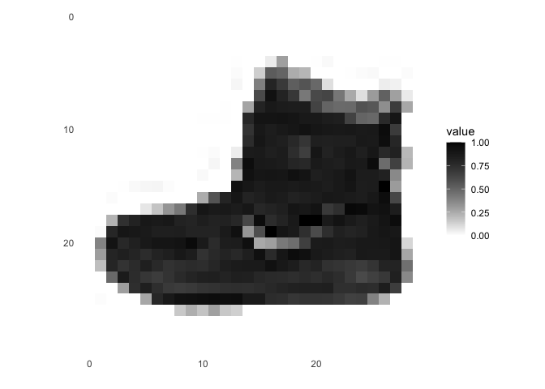
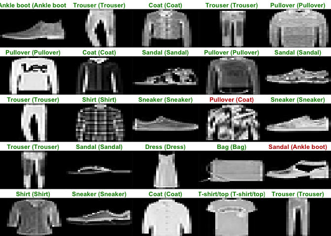
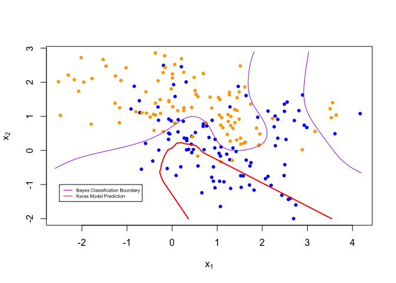
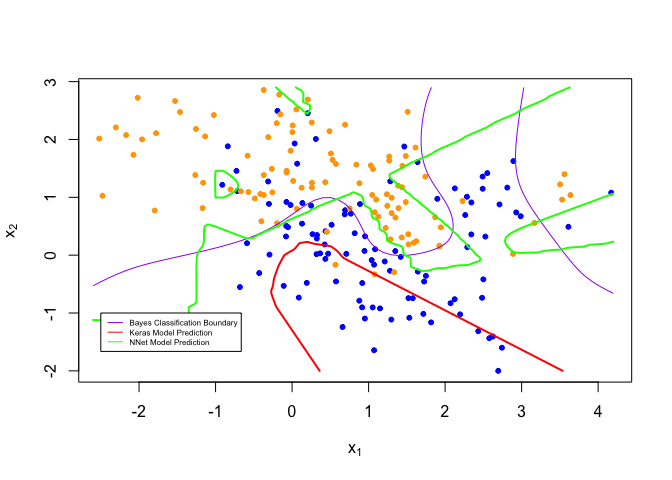

Homework7
================
Dakota Wilson
4/10/2022

### Work through the “Image Classification” tutorial on the RStudio Keras website.

``` r
#Loads data
fashion_mnist <- dataset_fashion_mnist()
```

    ## Loaded Tensorflow version 2.8.0

``` r
#Splits into train and test images
c(train_images, train_labels) %<-% fashion_mnist$train
c(test_images, test_labels) %<-% fashion_mnist$test
dim(train_images)
```

    ## [1] 60000    28    28

``` r
dim(test_images)
```

    ## [1] 10000    28    28

``` r
#stores vector of all names of objects for use later
class_names = c('T-shirt/top',
                'Trouser',
                'Pullover',
                'Dress',
                'Coat', 
                'Sandal',
                'Shirt',
                'Sneaker',
                'Bag',
                'Ankle boot')

#Grabs image 1
image_1 <- as.data.frame(train_images[1, , ])
colnames(image_1) <- seq_len(ncol(image_1))
image_1$y <- seq_len(nrow(image_1))
image_1 <- gather(image_1, "x", "value", -y)
image_1$x <- as.integer(image_1$x)
#Plots image 1
ggplot(image_1, aes(x = x, y = y, fill = value)) +
  geom_tile() +
  scale_fill_gradient(low = "white", high = "black", na.value = NA) +
  scale_y_reverse() +
  theme_minimal() +
  theme(panel.grid = element_blank())   +
  theme(aspect.ratio = 1) +
  xlab("") +
  ylab("")
```

<!-- -->

``` r
#Numeric color values are needed from 0 to 1, not 0 to 255
train_images <- train_images / 255
test_images <- test_images / 255
#plot again to ensure that it worked
image_1 <- as.data.frame(train_images[1, , ])
colnames(image_1) <- seq_len(ncol(image_1))
image_1$y <- seq_len(nrow(image_1))
image_1 <- gather(image_1, "x", "value", -y)
image_1$x <- as.integer(image_1$x)
#Plots image 1
ggplot(image_1, aes(x = x, y = y, fill = value)) +
  geom_tile() +
  scale_fill_gradient(low = "white", high = "black", na.value = NA) +
  scale_y_reverse() +
  theme_minimal() +
  theme(panel.grid = element_blank())   +
  theme(aspect.ratio = 1) +
  xlab("") +
  ylab("")
```

<!-- -->

``` r
#Display first 25 images in dataset and checks to ensure that labels are applied properly
par(mfcol=c(5,5))
par(mar=c(0, 0, 1.5, 0), xaxs='i', yaxs='i')
for (i in 1:25) { 
  img <- train_images[i, , ]
  img <- t(apply(img, 2, rev)) 
  image(1:28, 1:28, img, col = gray((0:255)/255), xaxt = 'n', yaxt = 'n',
        main = paste(class_names[train_labels[i] + 1]))
}
```

<!-- -->

``` r
#setting up the layers of the model
model <- keras_model_sequential()
model %>%
  #transforms from 28x28 pixel 2d array to 784 pixel 1d array
  layer_flatten(input_shape = c(28, 28)) %>%
  #first layer has 128 nodes
  layer_dense(units = 128, activation = 'relu') %>%
  #second layer has 10 nodes, softmax indicates that these will show probabilities adding to 1 that the image belongs in one of the 10 digit classes
  layer_dense(units = 10, activation = 'softmax')
```

``` r
#compiles the model
model %>% compile(
  optimizer = 'adam', 
  loss = 'sparse_categorical_crossentropy',
  metrics = c('accuracy')
)
```

``` r
#Train the model
model %>% fit(train_images, train_labels, epochs = 5, verbose = 2)
```

``` r
score <- model %>% evaluate(test_images, test_labels, verbose = 0)

cat('Test loss:', score[1], "\n")
```

    ## Test loss: 0.3401223

``` r
cat('Test accuracy:', score[2], "\n")
```

    ## Test accuracy: 0.879

``` r
#Make predictions on test set
predictions <- model %>% predict(test_images)
```

``` r
#Finally, plot predictions
par(mfcol=c(5,5))
par(mar=c(0, 0, 1.5, 0), xaxs='i', yaxs='i')
for (i in 1:25) { 
  img <- test_images[i, , ]
  img <- t(apply(img, 2, rev)) 
  # subtract 1 as labels go from 0 to 9
  predicted_label <- which.max(predictions[i, ]) - 1
  true_label <- test_labels[i]
  if (predicted_label == true_label) {
    color <- '#008800' 
  } else {
    color <- '#bb0000'
  }
  image(1:28, 1:28, img, col = gray((0:255)/255), xaxt = 'n', yaxt = 'n',
        main = paste0(class_names[predicted_label + 1], " (",
                      class_names[true_label + 1], ")"),
        col.main = color)
}
```

<!-- -->

### Use the Keras library to re-implement the simple neural network discussed during lecture for the mixture data (see nnet.R). Use a single 10-node hidden layer; fully connected.

``` r
#load data
load(url('https://web.stanford.edu/~hastie/ElemStatLearn/datasets/ESL.mixture.rda'))
mix <- ESL.mixture
```

``` r
set.seed(23188)
#initializes model
k_model <- keras_model_sequential()

#creates 10-node hidden layer
k_model %>%
  #builds 10-node hidden layer
  layer_dense(units = 10, activation = 'relu') %>%
  #builds binary output layer
  layer_dense(units = 2, activation = 'softmax') 

#complies model
k_model %>% compile(
  optimizer = 'adam', 
  loss = 'sparse_categorical_crossentropy',
  metrics = c('accuracy')
)
```

``` r
set.seed(23188)
#fits model
k_model %>% fit(x = mix$x, y = mix$y, epochs = 5, verbose = 2)
```

``` r
#checks accuracy and loss
k_score <- k_model %>% evaluate(mix$x, mix$y, verbose = 0)

cat('Test loss:', k_score[1], "\n")
```

    ## Test loss: 0.6313757

``` r
cat('Test accuracy:', k_score[2], "\n")
```

    ## Test accuracy: 0.625

``` r
#Uses Prof. Shotwell's code to print mixture data with true contour line
plot_mixture_data <- expression({
  plot(mix$x[,1], mix$x[,2],
       col=ifelse(mix$y==0, 'blue', 'orange'),
       pch=20,
       xlab=expression(x[1]),
       ylab=expression(x[2]))
  ## draw Bayes (True) classification boundary
  prob <- matrix(mix$prob, length(mix$px1), length(mix$px2))
  cont <- contourLines(mix$px1, mix$px2, prob, levels=0.5)
  rslt <- sapply(cont, lines, col='purple')
})
#tests to ensure it works
eval(plot_mixture_data)
```

<!-- -->

``` r
set.seed(23188)
#Predicts values based on constructed model
k_probs = k_model %>% predict(mix$xnew)
plot_k_preds <- function() {
  
  #plots original data
  eval(plot_mixture_data)

  #computes and plots keras prediction
  probs <- k_probs[,1]
  probm <- matrix(probs, length(mix$px1), length(mix$px2))
  cls <- contourLines(mix$px1, mix$px2, probm, levels=0.5)
  rslt <- sapply(cls, lines, col='red', lwd = 2)
  legend(-2.5,-1, legend=c("Bayes Classification Boundary", "Keras Model Prediction"), col=c("purple", "red"), lty=1:1, cex=0.5)
}

plot_k_preds()
```

<!-- -->

### Create a figure to illustrate that the predictions are (or are not) similar using the ‘nnet’ function versus the Keras model.

``` r
set.seed(23188)
#fit nnet model with same number of hidden nodes
nn_fit = nnet(x=mix$x, y=mix$y, size=10, entropy=TRUE, decay=0)
```

    ## # weights:  41
    ## initial  value 177.991396 
    ## iter  10 value 99.631532
    ## iter  20 value 88.569373
    ## iter  30 value 78.479826
    ## iter  40 value 70.983548
    ## iter  50 value 66.309949
    ## iter  60 value 65.935166
    ## iter  70 value 65.702164
    ## iter  80 value 65.268370
    ## iter  90 value 65.005693
    ## iter 100 value 64.639260
    ## final  value 64.639260 
    ## stopped after 100 iterations

``` r
#predict values based on new fit
nn_probs <- predict(nn_fit, mix$xnew, type="raw")[,1]
plot_nn_preds <- function() {
  
  #plots original data
  eval(plot_mixture_data)
  
  #plot nnet probs
  probs <- nn_probs
  probm <- matrix(probs, length(mix$px1), length(mix$px2))
  cls <- contourLines(mix$px1, mix$px2, probm, levels=0.5)
  rslt <- sapply(cls, lines, col='green', lwd = 2)
  
  #plot keras probs
  probs1 <- k_probs
  probm1 <-matrix(probs1, length(mix$px1), length(mix$px2))
  cls1 <- contourLines(mix$px1, mix$px2, probm1, levels=0.5)
  rslt1 <- sapply(cls1, lines, col='red', lwd = 2)
  
  #creates legend
  legend(-2.5,-1, legend=c("Bayes Classification Boundary", "Keras Model Prediction", "NNet Model Prediction"), col=c("purple", "red","green"), lty=1:1, cex=0.5)
  
}

plot_nn_preds()
```

<!-- -->
